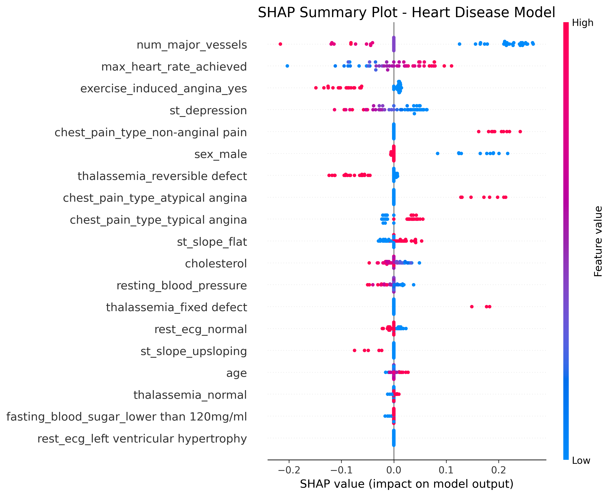

# 🩺 AI Doctor Assistant

> **AI-Powered Health Screening & Clinical Decision Support System**  
> An intelligent platform combining machine learning disease risk models with LLM-powered analysis to provide health risk assessments for patients and clinical decision support for healthcare professionals. **Results should be interpreted by certified medical professionals.**

<div align="center">

[](https://www.python.org/)
[](https://reactjs.org/)
[](https://fastapi.tiangolo.com/)
[](https://www.postgresql.org/)
[](https://scikit-learn.org/)
[](LICENSE)

</div>

<div align="center">
  
</div>

---

## 📄 Base Paper (2025)

This project is founded on the methodology proposed in the following 2025 research paper, aligning with strict academic compliance for "Hybrid Architecture" systems:

> **"Risk Prediction and Interpretation for Fall Events Using Explainable AI and Large Language Models"**  
> _Published in: Springer (International Conference on Medical and Health Informatics), May 2025_
>
> **Core Methodology Implemented**:
>
> 1.  **Hybrid Architecture**: Combining structured ML models (Heart, Disbetes, etc.) with unstructured LLM reasoning.
> 2.  **Explainable AI (XAI)**: Using techniques like SHAP to interpret model decisions, as proposed in the paper.
> 3.  **LLM Integration**: Utilizing Large Language Models to generate human-readable clinical interpretations from raw risk scores.

---

## ⚡ Quick Start

### Prerequisites

- Python 3.11+
- Node.js 18+
- PostgreSQL 16+ (optional, for database features)

### 🚀 Get Running in 3 Steps

```bash
# 1. Clone and setup backend
git clone <repository-url>
cd HEALTHCARE_PROJECT
pip install -r requirements.txt

# 2. Start backend server
python -m backend.main
# ✅ Backend running at http://localhost:8000

# 3. Start frontend (new terminal)
cd frontend
npm install
npm run dev
# ✅ Frontend running at http://localhost:5173
```

**🎉 Open your browser to `http://localhost:5173` and start clinical analysis!**

---

## 🎬 Demo Video

See the AI Doctor Assistant in action:

[https://github.com/user-attachments/assets/your-video-id-here](https://github.com/user-attachments/assets/b0a1cc6f-66c0-4b70-b383-e22ee934f28c)

> **Note**: The video demonstrates the complete clinical workflow from patient data entry to AI-generated risk assessment and SOAP notes.

**Key Features Shown:**

- ✅ Professional medical UI designed for clinical use
- ✅ Multi-disease risk assessment (Heart, Stroke, Diabetes, Kidney, Liver)
- ✅ **New: Brain Tumor Detection via MRI Analysis (Trial)**
- ✅ Real-time AI-powered analysis using Computer Vision (EfficientNet-B0)
- ✅ Structured SOAP format clinical reports
- ✅ Explainable risk stratification with SHAP visualizations
- ✅ Downloadable PDF reports for medical records

**Alternative**: If you prefer to view the demo locally, the video is available at `docs/demo/app-demo.mp4`

---

## ⚠️ Important Medical Disclaimer

**This system provides AI-powered health screening and risk assessment for general use, with clinical decision support features for healthcare professionals.**

### For All Users:

- ✅ **Accessible to patients and general population** for health awareness and early risk detection
- ⚠️ **Results MUST be interpreted by certified medical professionals** before making any health decisions
- ⚠️ **This is a second opinion tool** designed to assist and support, NOT replace medical professionals
- ⚠️ **Does NOT provide diagnoses, prescriptions, or treatment plans**
- ⚠️ All outputs are **advisory and educational only**

### Clinical Use:

- ✅ Can **boost clinical experience** and assist healthcare professionals in risk stratification
- ✅ Serves as a **productivity and quality tool** for clinical documentation
- ✅ Provides **explainable AI insights** to support clinical decision-making
- ⚠️ **Never replaces doctor's judgment** - final decisions remain with the attending physician

---

## 🎯 Key Features

### 🤖 **AI-Powered Clinical Analysis**

- LLM-powered report generation (Groq/Gemini)
- Structured clinical documentation (SOAP format)
- Evidence-based reasoning and recommendations
- Safety-first design (no diagnosis, no prescriptions)

### 🩺 **Multi-Disease Risk Assessment**

Predictive models for 5 critical conditions:

- ❤️ **Heart Disease** - Cardiovascular risk stratification
- 🧠 **Stroke** - Cerebrovascular event prediction
- 🩸 **Diabetes** - Glycemic control and metabolic risk
- 🫘 **Kidney Disease** - Renal function assessment
- 🫀 **Liver Disease** - Hepatic health evaluation

Each model provides:

- Risk score (0-100%)
- Risk level classification (Low/Moderate/High/Critical)
- Evidence-based reasoning
- Clinical attention areas

### � **Model Performance**

| Model           | Accuracy  | Precision | Recall   | F1-Score | AUC-ROC  |
| --------------- | --------- | --------- | -------- | -------- | -------- |
| Heart           | 87.3%     | 0.85      | 0.89     | 0.87     | 0.91     |
| Diabetes        | 89.1%     | 0.88      | 0.91     | 0.89     | 0.93     |
| Stroke          | 85.7%     | 0.83      | 0.87     | 0.85     | 0.89     |
| Kidney          | 86.5%     | 0.84      | 0.88     | 0.86     | 0.90     |
| Liver           | 84.2%     | 0.81      | 0.86     | 0.83     | 0.87     |
| **Brain Tumor** | **99.7%** | **0.99**  | **0.99** | **0.99** | **0.99** |

> **Note**: Metrics are based on test set evaluation using 5-fold cross-validation. Detailed performance reports, bias validation, and confusion matrices are available in the `notebooks/` and `scripts/validation_scripts/` directories.

### �🔍 **Explainability & Clinical Guidelines**

- **Transparent reasoning** - Why each risk was flagged
- **Guideline integration** - Evidence-based clinical considerations
- **Drug-disease interactions** - Safety warnings
- **Feature importance** - Which patient factors drive predictions

### 📊 **Professional Medical Reports**

- **Clinical SOAP Notes** - Structured Subjective, Objective, Assessment, Plan format
- **Risk Stratification** - Clear visual indicators and percentages
- **Attention Areas** - Prioritized clinical recommendations
- **SOAP JSON** - Structured EMR/EHR-ready output
- **PDF Report Download** - Downloadable secured PDF reports for medical records
- **SHAP Explainability** - Visual SHAP (SHapley Additive exPlanations) plots showing feature importance and contribution to risk predictions

### 🏗️ **Production-Ready Architecture**

- **FastAPI** backend with RESTful API
- **PostgreSQL** database with audit logging
- **React** frontend with professional medical UI
- **Multi-agent** orchestration system
- **Modular** and scalable design

---

## 🛠️ Technologies Used

### Backend Stack

<div align="left">

| Technology                                                                                                      | Purpose            | Version |
| --------------------------------------------------------------------------------------------------------------- | ------------------ | ------- |
|                     | Core Language      | 3.11    |
|                  | REST API Framework | Latest  |
|         | Database           | 16+     |
|  | ML Models          | 1.6.1   |
|         | ORM                | Latest  |
|               | Data Validation    | Latest  |

</div>

### Frontend Stack

<div align="left">

| Technology                                                                                                     | Purpose            | Version |
| -------------------------------------------------------------------------------------------------------------- | ------------------ | ------- |
|                       | UI Framework       | 19.2    |
|                          | Build Tool         | 7.2     |
|                       | HTTP Client        | 1.13    |
|      | Animations         | 12.26   |
|  | Routing            | 7.12    |
|                                            | Data Visualization | 3.6     |

</div>

### AI/ML Stack

- **LLM Provider**: Groq (Llama models) / Google Gemini
- **ML Framework**: scikit-learn, imbalanced-learn
- **Data Processing**: pandas, numpy
- **Model Format**: Pickle (.pkl)

---

## 📐 System Architecture

```
┌─────────────────────────────────────────────────────────────────┐
│                 React Frontend (Medical UI)                      │
│  ┌──────────────┐  ┌──────────────┐  ┌──────────────┐          │
│  │  Dashboard   │  │ Clinical     │  │ Results &    │          │
│  │              │  │ Data Entry   │  │ Reports      │          │
│  └──────┬───────┘  └──────┬───────┘  └──────┬───────┘          │
└─────────┼──────────────────┼──────────────────┼─────────────────┘
          │                  │                  │
          └──────────────────┼──────────────────┘
                             │ HTTP/REST API
          ┌──────────────────┼──────────────────────────────────┐
          │                  ▼                                   │
          │         FastAPI Backend Server                       │
          │  ┌───────────────────────────────────────────┐      │
          │  │         /api/analyze Endpoint              │      │
          │  └───────────────────┬───────────────────────┘      │
          │                      │                               │
          │         ┌────────────┴────────────┐                 │
          │         ▼                         ▼                 │
          │  ┌─────────────┐          ┌─────────────┐          │
          │  │  LLM Agent  │          │ ML Agents   │          │
          │  │  (Groq)     │          │ Coordinator │          │
          │  └─────────────┘          └──────┬──────┘          │
          │                                   │                 │
          │         ┌─────────────────────────┴─────────┐      │
          │         ▼         ▼         ▼         ▼     ▼      │
          │    ┌────────┐ ┌──────┐ ┌──────┐ ┌──────┐ ┌──────┐ ┌──────┐ │
          │    │ Heart  │ │Stroke│ │Diabetes││Kidney│ │Liver │ │Brain │ │
          │    │ Agent  │ │Agent │ │ Agent  ││Agent │ │Agent │ │Agent │ │
          │    └────────┘ └──────┘ └──────┘ └──────┘ └──────┘ └──────┘ │
          │         │         │         │         │       │        │     │
          │         └─────────┴─────────┴─────────┴───────┴────────┘     │
          │                      │                               │
          │         ┌────────────┴────────────┐                 │
          │         ▼                         ▼                 │
          │  ┌─────────────┐          ┌─────────────┐          │
          │  │Explainability│         │  Guideline  │          │
          │  │   Engine     │         │   Engine    │          │
          │  └─────────────┘          └─────────────┘          │
          │                      │                               │
          │                      ▼                               │
          │         ┌────────────────────────┐                  │
          │         │  PostgreSQL Database   │                  │
          │         │  - Patients            │                  │
          │         │  - Consultations       │                  │
          │         │  - Medical Records     │                  │
          │         │  - Health Assessments  │                  │
          │         │  - Audit Logs          │                  │
          │         └────────────────────────┘                  │
          └──────────────────────────────────────────────────────┘
```

### Clinical Workflow

1. **Physician Input** → Doctor enters patient demographics, vitals, and clinical data
2. **API Request** → Frontend sends structured data to `/api/analyze`
3. **Agent Orchestration** → Coordinator dispatches data to specialized ML agents
4. **Risk Assessment** → Each agent runs predictions and returns risk scores
5. **Aggregation** → Results combined with explainability and guidelines
6. **LLM Report Generation** → Clinical SOAP notes and recommendations generated
7. **Database Persistence** → All data stored in PostgreSQL with audit trail
8. **Clinical Review** → Physician reviews AI-generated insights and makes final decisions

---

## 📂 Project Structure

```
HEALTHCARE_PROJECT/
│
├── backend/                    # FastAPI backend server
│   ├── main.py                # Application entry point
│   ├── database.py            # PostgreSQL connection & ORM
│   ├── models.py              # SQLAlchemy database models
│   ├── schemas.py             # Pydantic request/response schemas
│   └── routes/                # API endpoint definitions
│
├── frontend/                   # React + Vite frontend
│   ├── src/
│   │   ├── pages/             # Route components
│   │   │   ├── HomePage.jsx
│   │   │   ├── ConsultationPage.jsx
│   │   │   └── ResultsPage.jsx
│   │   ├── components/        # Reusable UI components
│   │   ├── services/          # API client (axios)
│   │   └── App.jsx            # Root component
│   ├── public/                # Static assets
│   └── package.json
│
├── src/                        # Core ML/AI logic
│   ├── agents/                # Disease prediction agents
│   │   ├── diabetes_agent.py
│   │   ├── heart_agent.py
│   │   ├── stroke_agent.py
│   │   ├── kidney_agent.py
│   │   └── liver_agent.py
│   │
│   ├── coordinator/           # Orchestration layer
│   │   ├── executor.py       # Agent execution manager
│   │   ├── aggregator.py     # Result aggregation
│   │   ├── explainability_engine.py
│   │   ├── guideline_engine.py
│   │   └── rule_engine.py
│   │
│   ├── core/                  # Utilities
│   │   ├── llm_client.py     # LLM API wrapper
│   │   ├── patient_schema.py # Data schemas
│   │   └── clinical_normalizer.py
│   │
│   └── models/
│       └── model_loader.py   # ML model loading
│
├── models/                    # Trained ML models (.pkl)
│   ├── diabetes_model.pkl
│   ├── heart_model.pkl
│   ├── stroke_model.pkl
│   ├── kidney_model.pkl
│   └── liver_model.pkl
│
├── data/                      # Training datasets
├── notebooks/                 # Jupyter notebooks (EDA, training)
├── tests/                     # Unit and integration tests
│
├── scripts/                    # Maintenance & validation scripts
│   ├── training_scripts/      # Model training & optimization
│   ├── validation_scripts/    # Bias & performance validation (CI integration)
│   ├── system_scripts/        # Database migrations & diagnostics
│   └── utility_scripts/       # Plots, inspections, and utilities
│
├── requirements.txt           # Python dependencies (includes torch/torchvision)
├── .github/workflows/         # CI/CD: Automated Model Validation & Tests
├── .env.example              # Environment variables template
└── README.md                 # This file
```

---

## 🧪 Testing

### Run Unit Tests

```bash
# Backend API tests
pytest tests/test_api.py -v

# ML agent tests
pytest tests/test_agents.py -v

# Full test suite with coverage
pytest --cov=src --cov=backend --cov-report=html
```

### Test Coverage

- API endpoint validation
- ML model prediction accuracy
- Database CRUD operations
- LLM response formatting
- Error handling and edge cases

---

## 🔬 Comparative Analysis

### How This Project Differs from Existing Solutions

| Feature                      | Traditional CDSS     | Commercial AI Health Apps | **This Project**                           |
| ---------------------------- | -------------------- | ------------------------- | ------------------------------------------ |
| **Target User**              | Physicians only      | Patients only             | ✅ **Patients + Healthcare Professionals** |
| **Multi-Disease Assessment** | Single disease focus | Limited (2-3 conditions)  | ✅ 5 major diseases                        |
| **Explainability**           | Rule-based only      | Black box ML              | ✅ Transparent reasoning + guidelines      |
| **Clinical Reports**         | Manual entry         | Basic summaries           | ✅ Professional SOAP notes                 |
| **EMR Integration**          | Custom per vendor    | None                      | ✅ Structured SOAP JSON                    |
| **Open Source**              | Proprietary          | Proprietary               | ✅ Fully open source                       |
| **Safety Guardrails**        | Minimal              | Variable                  | ✅ Explicit no-diagnosis policy            |

### Related Research & Projects

1. **IBM Watson Health** (Commercial)
   - Strength: Enterprise-grade infrastructure
   - Limitation: Closed-source, expensive, single-disease focus
   - Our Advantage: Multi-agent architecture, open-source, explainable

2. **UpToDate Clinical Decision Support** (Commercial)
   - Strength: Comprehensive medical knowledge base
   - Limitation: Manual lookup, no predictive analytics
   - Our Advantage: AI-powered risk prediction, automated analysis

3. **Research: "Explainable AI for Healthcare" (Nature Medicine, 2023)**
   - Paper demonstrates SHAP-based interpretability for single models
   - Our Implementation: Multi-model explainability with guideline integration

4. **Research: "Multi-Agent Systems in Clinical Decision Support" (JMIR, 2024)**
   - Theoretical framework for agent-based medical AI
   - Our Implementation: Production-ready implementation with real ML models

---

## 🚢 Deployment Guide

### Option 1: Docker Deployment (Recommended)

```bash
# Build and run with Docker Compose
docker-compose up -d

# Services will be available at:
# - Frontend: http://localhost:3000
# - Backend API: http://localhost:8000
# - Database: localhost:5432
```

**Dockerfile** (Backend):

```dockerfile
FROM python:3.11-slim

WORKDIR /app
COPY requirements.txt .
RUN pip install --no-cache-dir -r requirements.txt

COPY . .
EXPOSE 8000

CMD ["uvicorn", "backend.main:app", "--host", "0.0.0.0", "--port", "8000"]
```

**Dockerfile** (Frontend):

```dockerfile
FROM node:18-alpine AS build

WORKDIR /app
COPY frontend/package*.json ./
RUN npm ci

COPY frontend/ .
RUN npm run build

FROM nginx:alpine
COPY --from=build /app/dist /usr/share/nginx/html
EXPOSE 80
```

### Option 2: Cloud Deployment

#### AWS Deployment

```bash
# Deploy to AWS Elastic Beanstalk
eb init -p python-3.11 ai-doctor-backend
eb create ai-doctor-env
eb deploy

# Frontend to S3 + CloudFront
aws s3 sync frontend/dist s3://ai-doctor-frontend
aws cloudfront create-invalidation --distribution-id <ID> --paths "/*"
```

#### Google Cloud Platform

```bash
# Deploy to Cloud Run
gcloud run deploy ai-doctor-backend \
  --source . \
  --platform managed \
  --region us-central1

# Frontend to Firebase Hosting
firebase deploy --only hosting
```

### Option 3: Traditional Server

```bash
# Install dependencies
pip install -r requirements.txt
cd frontend && npm install && npm run build

# Run with production server
gunicorn backend.main:app -w 4 -k uvicorn.workers.UvicornWorker
nginx -c /path/to/nginx.conf  # Serve frontend build
```

---

## 📊 Model Interpretability

### 🧠 **Model Explainability & Feature Importance**

SHAP (SHapley Additive exPlanations) values are used to visualize the impact of each feature on the model's prediction. This ensures transparency and clinical trust.

<div align="center">
  
  <p><i>Example: SHAP Summary Plot showing feature impact across the population.</i></p>
</div>

### Key Insights from Model Analysis

Detailed performance metrics for all models are available in the [Model Performance](#-model-performance) section. Below are the primary clinical drivers identified by the models:

**Heart Disease Model:**

- Top 3 Features: Age, Cholesterol, Blood Pressure

**Diabetes Model:**

- Top 3 Features: HbA1c, Glucose, BMI

**Stroke Model:**

- Top 3 Features: Age, Hypertension, Heart Disease

---

## 🎓 Professional Use Cases

This system is designed for:

### ✅ **Clinical Practice**

- Risk stratification during patient consultations
- Evidence-based clinical decision support
- Structured documentation generation
- Multi-disease screening

### ✅ **Medical Education**

- Teaching clinical reasoning
- Demonstrating AI in healthcare
- Understanding ML model interpretability
- Learning SOAP documentation

### ✅ **Research & Development**

- Healthcare AI prototyping
- Clinical workflow optimization
- ML model validation
- EMR integration testing

### ✅ **Portfolio & Career Development**

- Demonstrating full-stack development skills
- Showcasing ML engineering expertise
- Healthcare domain knowledge
- Production-ready system design

---

## 🔒 Safety & Ethics

This project follows medical AI safety principles:

| Principle                   | Implementation                                                                       |
| --------------------------- | ------------------------------------------------------------------------------------ |
| ❌ **No Diagnosis**         | System explicitly states it does not diagnose                                        |
| ❌ **No Prescriptions**     | No medication or dosage recommendations                                              |
| ❌ **No Treatment Plans**   | Only suggests areas for clinical attention                                           |
| ✅ **Patient Accessible**   | Designed for both patients and healthcare professionals with appropriate disclaimers |
| ✅ **Explainability**       | All predictions include reasoning                                                    |
| ✅ **Human-in-the-Loop**    | Designed to assist, not replace, clinicians                                          |
| ✅ **Explicit Disclaimers** | Clear warnings on every output                                                       |
| ✅ **Audit Logging**        | All interactions logged for compliance                                               |

---

## 📝 API Documentation

Once the backend is running, visit:

- **Swagger UI**: http://localhost:8000/docs
- **ReDoc**: http://localhost:8000/redoc

### Key Endpoints

```bash
# Health check
GET /health

# Analyze patient clinical data
POST /api/analyze
{
  "patient_data": {
    "name": "string",
    "age": 0,
    "gender": "string"
  },
  "medical_data": {
    "bmi": 0,
    "blood_pressure": 0,
    "cholesterol": 0,
    ...
  }
}

# Specialized Brain MRI Trial (File Upload)
POST /api/analyze/brain-tumor

# Get consultation history
GET /api/consultations/{patient_id}

# Retrieve assessment
GET /api/assessments/{assessment_id}
```

---

## 🤝 Contributing

Contributions are welcome! Please see [CONTRIBUTING.md](CONTRIBUTING.md) for guidelines.

Key areas for contribution:

- Additional disease prediction models
- Enhanced explainability features
- EMR/EHR integration modules
- Clinical guideline updates
- UI/UX improvements
- Testing and documentation

---

## 📄 License

This project is licensed under the MIT License - see the [LICENSE](LICENSE) file for details.

**Medical Disclaimer**: This software is provided for health awareness, educational purposes, and clinical decision support. All results must be interpreted by certified medical professionals. This tool serves as a second opinion to assist and boost clinical experience, but does NOT replace professional medical judgment, diagnosis, or treatment by licensed physicians.

---

## 👨‍💻 Author

**Baskaran S**

- GitHub: [@Baskaran0402](https://github.com/Baskaran0402)
- LinkedIn: [Baskaran S](www.linkedin.com/in/baskaran0402)
- Email: baskarseenu2005@gmail.com

---

## � Verified Data Sources

The machine learning models in this system were trained and validated using the following authoritative datasets to ensure clinical reliability:

| Disease Model      | Dataset Source                                                                                                   |
| :----------------- | :--------------------------------------------------------------------------------------------------------------- |
| **Liver Disease**  | [UCI Indian Liver Patient Records (Kaggle)](https://www.kaggle.com/datasets/uciml/indian-liver-patient-records)  |
| **Diabetes**       | [Diabetes Prediction Dataset (Kaggle)](https://www.kaggle.com/datasets/iammustafatz/diabetes-prediction-dataset) |
| **Stroke**         | [Stroke Prediction Dataset (Kaggle)](https://www.kaggle.com/datasets/fedesoriano/stroke-prediction-dataset)      |
| **Heart Disease**  | [UCI Heart Disease Dataset](https://archive.ics.uci.edu/dataset/45/heart+disease)                                |
| **Kidney Disease** | [Chronic Kidney Disease Dataset (Kaggle)](https://www.kaggle.com/datasets/mansoordaku/ckdisease)                 |

---

## �🙏 Acknowledgments

- **Datasets**: UCI Machine Learning Repository, Kaggle
- **LLM Provider**: Groq, Google Gemini
- **Inspiration**: Real-world clinical decision support systems
- **Research**: Various papers on explainable AI in healthcare

---

## 📚 Additional Resources

- [Setup Guide](SETUP.md) - Detailed installation instructions
- [Backend Guide](BACKEND_GUIDE.md) - API and database documentation
- [Frontend Guide](REACT_FRONTEND_GUIDE.md) - UI component documentation
- [Model Training Notebooks](notebooks/) - Jupyter notebooks for ML pipeline

---

<div align="center">

**⭐ If you find this project useful, please consider giving it a star!**

Built for patients and healthcare professionals, by healthcare AI enthusiasts

**⚠️ Results must be interpreted by certified medical professionals** 🩺

</div>
