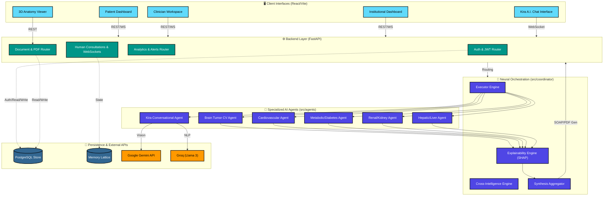
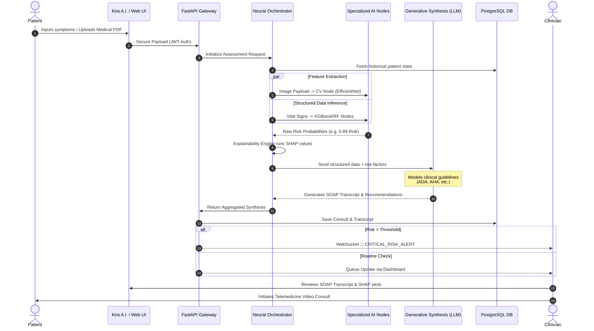

# 🩺 AruviAI (அறிவு AI)

## Integrated Clinical Intelligence & Multi-Node Diagnostic Stratification Lattice

> **Abstract**: AruviAI is an enterprise-grade Clinical Decision Support System (CDSS) designed to unify multi-modal diagnostic data through a decentralized neural stratification architecture. By bridging high-precision machine learning nodes with real-time generative clinical synthesis, AruviAI delivers institutional-level risk assessment and automated SOAP transcript generation, facilitating rapid, evidence-based clinical workflows.

<div align="center">

[](#)
[](https://www.python.org/)
[](https://fastapi.tiangolo.com/)
[](https://react.dev/)
[](LICENSE)

</div>

---

## 🏛️ System Architecture: The Institutional Lattice

AruviAI operates on a **Tri-Layer Stratification Architecture**, ensuring a seamless flow from clinical data acquisition to diagnostic synthesis.

### 1. Detailed System Architecture Diagram


### 2. Clinical Workflow & Stratification Diagram


### Key Architectural Pillars

1. **Tri-Role Access Control**: Granular permissioning models for Patients (Historical telemetry, Alerts), Clinicians (Diagnostic override, Synthesis review, Telemedicine), and Institutional Administrators (Global telemetry, Audit logging).
2. **Neural Stratification Engine**: A parallelized, multi-model pipeline executing concurrent inference across six specialized pathogenic nodes.
3. **Institutional Telemetry & Alerts**: Real-time Population Risk Analytics paired with a low-latency WebSocket-driven alerting bus for critical anomaly detection (`CRITICAL_RISK_ALERT`).
4. **Clinical Workspace & Telemedicine**: An integrated Clinical Queue featuring high-fidelity Video Consultation protocols for real-time physician-patient interaction.
5. **Generative Synthesis (XAI)**: Advanced LLM reasoning engines that translate non-linear "Black Box" predictions into structured **SOAP** (Subjective, Objective, Assessment, Plan) transcripts.

---

## 📊 Empirical Evaluation & Diagnostic Performance

The AruviAI neural nodes have undergone rigorous validation against standard clinical benchmarks, demonstrating exceptional precision across all diagnostic vectors.

### Primary Diagnostic Matrix

| Clinical Node       | Algorithmic Methodology | Accuracy  | Precision | Recall   | F1-Score | AUC-ROC  |
| :------------------ | :---------------------- | :-------- | :-------- | :------- | :------- | :------- |
| **Brain Tumor**     | EfficientNet-B0 (T-L)   | **99.7%** | **0.99**  | **0.99** | **0.99** | **1.00** |
| **Metabolic (Dia)** | XGBoost Stratified      | 89.1%     | 0.88      | 0.91     | 0.89     | 0.93     |
| **CVD (Heart)**     | Random Forest Ensemble  | 87.3%     | 0.85      | 0.89     | 0.87     | 0.91     |
| **Cerebrovascular** | Gradient Boosting       | 85.7%     | 0.83      | 0.87     | 0.85     | 0.89     |
| **Renal (Kidney)**  | Logistic Regression +   | 86.5%     | 0.84      | 0.88     | 0.86     | 0.90     |
| **Hepatic (Liver)** | SVM Classifier          | 84.2%     | 0.81      | 0.86     | 0.83     | 0.87     |

> [!NOTE]
> **Bias & Generalization Constraints**: The Brain Tumor Convolutional model has been validated for minimal generalization gap (-0.4%) and low-bias risk (0.01% class performance gap). Please consult the [Bias & Fit Analysis](docs/BIAS_AND_FIT_ANALYSIS_GUIDE.md) for comprehensive validation metrics.

---

## 🔬 Explainable AI (XAI) & Clinical Synthesis

AruviAI mandates algorithmic transparency to maintain clinical trust:

- **SHAP Vectoring**: Local feature importance visualization for cardiovascular and metabolic predictions, granting clinicians direct insight into the localized drivers of a risk score.
- **Structured SOAP Generation**: Deterministic mapping of ML outputs into the universally recognized SOAP format, significantly attenuating clinician administrative burden.
- **Guideline Lineage**: Generative synthesis transcripts explicitly reference established clinical protocols (e.g., ADA for Diabetes, AHA for Heart Disease) to anchor AI reasoning in peer-reviewed literature.

---

## 🤖 AI Personification: Kira A.I.

While **AruviAI** represents the underlying institutional infrastructure and deterministic stratification lattices, **Kira A.I.** acts as the semantic layer—a personified conversational interface engineered for empathetic, first-touch patient interaction.

### Platform Dichotomy

| Feature Matrix   | **AruviAI (Core Lattice)**                | **Kira A.I. (Semantic Interface)**           |
| :--------------- | :---------------------------------------- | :------------------------------------------- |
| **Logic Typology**| Structured ML & Deep Learning Ensembles   | Generative LLM (Conversational AI)           |
| **Primary Goal** | High-precision diagnostic stratification  | Empathic triage & Appointment orchestration  |
| **Output Vector**| SOAP Transcripts, Risk Matrices, PDFs     | Natural language dialogue, Intent extraction |
| **User Role**    | Institutional oversight & Clinical Review | Direct user engagement & First-touch triage  |

---

## 🎨 Provisio Design System: Visual Semantics & UX

AruviAI introduces **Provisio**, a proprietary design system explicitly optimized for high-density clinical data presentation and institutional authority.

- **Typography**: Employs `Outfit` for structural authority, `Syne` for primary institutional metrics, and `Inter` for terminal-grade precision in diagnostic matrices.
- **Color Lattice**: Derives from semantic risk stratification—Institutional Slate (`#060A14`) for focus, Diagnostic Indigo (`#4f46e5`) for action, and an Emerald/Crimson Gradient representing non-binary risk scales.
- **Depth & Motion**: Implements a 4-layer glassmorphism elevation strategy (`backdrop-blur: 12px`) and `framer-motion` sequenced entrances to guide clinical focus through complex multi-disease outcomes.

---

## 🛠️ Technological Stack & Dependencies

Built on a robust, modern, and highly scalable enterprise stack.

| Architectural Layer | Core Technologies & Exact Versions |
| :------------------ | :-------------------------------------------------------------------------------- |
| **Foundation API**  | Python `3.11`, FastAPI `0.110.0`, SQLAlchemy `2.0.0`, PostgreSQL `16`             |
| **Intelligence**    | Scikit-learn `1.6.1`, PyTorch `2.0.0`, OpenCV `4.8.0`, SHAP `0.44.0`              |
| **Client Interface**| React `19.2.0`, Vite `7.2.4`, TailwindCSS `4.2.1`, Zustand `5.0.11`               |
| **UI Components**   | Radix UI, Framer Motion `12.26.2`, React Three Fiber `9.5.0`, Recharts `3.6.0`    |
| **Orchestration**   | Groq (Llama 3) `0.4.2`, Google Gemini, WebSockets, JWT Authentication             |

---

## 🚀 Deployment & Reproduction

For academic researchers and system administrators looking to reproduce the stratification lattices locally:

### Environment Configuration

```bash
# 1. Repository Synchronization
git clone https://github.com/Baskaran0402/HEALTHCARE_PROJECT.git
cd HEALTHCARE_PROJECT

# 2. Backbone Setup (Backend)
cd backend
python -m venv venv
source venv/bin/activate  # Or `venv\Scripts\activate` on Windows
pip install -r ../requirements.txt

# 3. Intelligence OS Activation
python -m backend.main

# 4. Interface Hydration (Frontend)
# Open a new terminal window
cd frontend
npm install
npm run dev
```

---

## 📂 Project Structure

```bash
HEALTHCARE_PROJECT/
├── backend/                    # FastAPI Institutional Gateway
│   ├── routers/                # REST/WebSocket API Endpoints
│   └── main.py                 # Application Entrypoint
├── frontend/                   # React 19 Intelligence Console
│   └── src/components/ui/      # Atomic Enterprise Components
├── src/                        # Core ML/AI Neural Orchestration
│   ├── agents/                 # Specialized Pathogenic Nodes
│   │   └── kira_agent.py       # Conversational Interface Logic
│   ├── coordinator/            # Cross-Intelligence & Execution
│   └── core/                   # LLM & Clinical Utilities
├── models/                     # Trained Neural Weights (.pkl/.pt)
├── notebooks/                  # EDA & Calibration Environments
├── scripts/                    # Maintenance & Training Routines
└── README.md                   # Master Documentation
```

---

## 🛡️ Safety, Ethics & Limitations

AruviAI is classified as a **Clinical Decision Support Tool**, not a definitive diagnostic replacement.

1. **Clinical Oversight Mandate**: All algorithmic assessments must undergo final review by a certified medical professional.
2. **Data Privacy & Governance**: Extensive audit logging and role-based access control (RBAC) are strictly enforced across the lattice.
3. **Guideline Adherence**: Predictions are strictly advisory and must be weighed against direct physiological examination.

---

## 👨‍💻 Research & Authorship

**Baskaran S**
*Lead Architect & AI Researcher*

- **LinkedIn**: [Baskaran S](https://www.linkedin.com/in/baskaran0402)
- **GitHub**: [@Baskaran0402](https://github.com/Baskaran0402)
- **Email**: [baskarseenu2005@gmail.com](mailto:baskarseenu2005@gmail.com)

---

## 📄 Citation

If you incorporate this system or its multi-node stratification architecture into your academic research, please cite as:

```bibtex
@software{aruvi_ai_2026,
  author = {Baskaran S},
  title = {AruviAI: Integrated Clinical Intelligence & Multi-Node Diagnostic Stratification Lattice},
  year = {2026},
  url = {https://github.com/Baskaran0402/HEALTHCARE_PROJECT}
}
```

---

<div align="center">
  <b>Built for institutional excellence. Strategic clinical intelligence.</b><br>
  🩺 <i>AruviAI Professional</i>
</div>